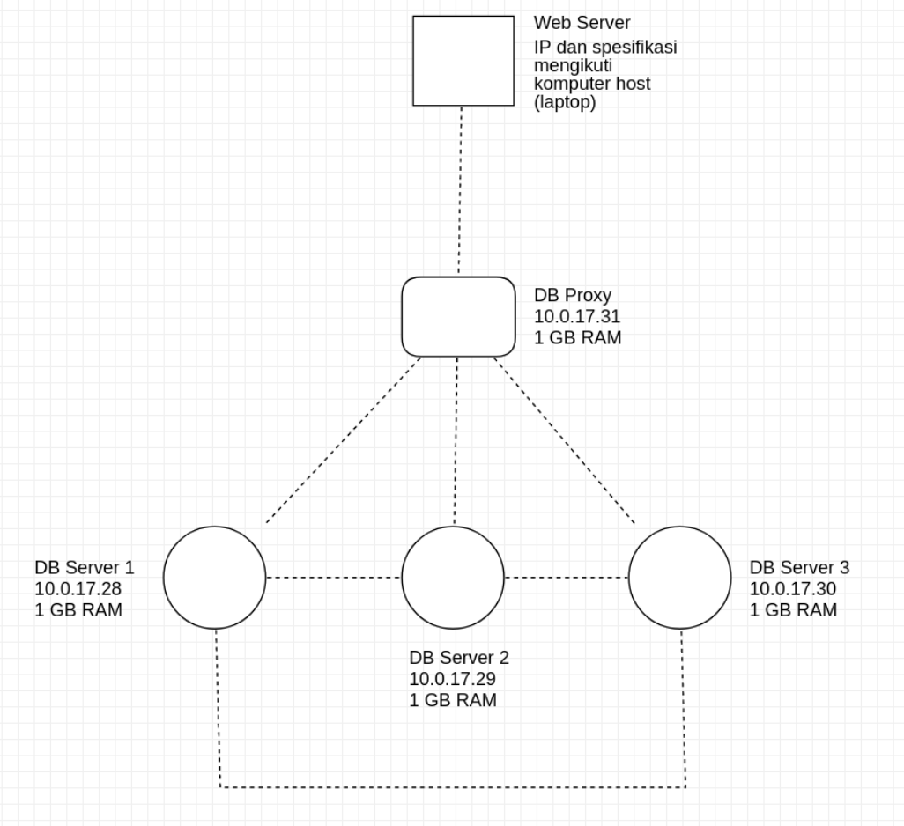

# Basis Data Terdistribusi

## Desain Infrastruktur

Berikut merupakan desain infrastruktur:

 

## Konfigurasi

### `Vagrantfile`

Untuk setiap node database dan proxy (dengan group replication):

- `node.vm.hostname`: Nama host VM database. Dalam konfigurasi ini diisi `db#{i}` untuk host ke-`i`

- `node.vm.box	`: Image VM yang digunakan. Dalam konfigurasi ini digunakan `bento/ubuntu-16.04`

- `node.vm.network "private_network"`: Konfigurasi network yang digunakan VM. IP yang digunakan adalah `10.0.17.#{27+i}` untuk host ke-`i`. 

Untuk konfigurasi VirtualBox untuk setiap node:

- `vb.name`: Nama virtual box
- `vb.gui`: *Boolean flag* untuk menggunakan GUI VirtualBox
- `vb.memory`: Memori yang digunakan VirtuaBox

Untuk provisioning database:

- `node.vm.provision "shell"`: Provisioning dengan *shell* dengan *path* `deployMSQL1#{i}.sh` dan tidak menggunakan mode *priviledged* untuk host ke-`i` 

Untuk provisioning proxy:

- `node.vm.provision "shell"`: Provisioning dengan *shell* dengan *path* `deployProxySQL.sh` dan tidak menggunakan mode *priviledged* untuk host ke-`i` 

### `deployMySQL1#{i}.sh`

```shell
# Changing the APT sources.list to kambing.ui.ac.id
sudo cp '/vagrant/sources.list' '/etc/apt/sources.list'

# Updating the repo with the new sources
sudo apt-get update -y

# Install required library
sudo apt-get install libaio1
sudo apt-get install libmecab2

# Get MySQL binaries
curl -OL https://dev.mysql.com/get/Downloads/MySQL-5.7/mysql-common_5.7.23-1ubuntu16.04_amd64.deb
curl -OL https://dev.mysql.com/get/Downloads/MySQL-5.7/mysql-community-client_5.7.23-1ubuntu16.04_amd64.deb
curl -OL https://dev.mysql.com/get/Downloads/MySQL-5.7/mysql-client_5.7.23-1ubuntu16.04_amd64.deb
curl -OL https://dev.mysql.com/get/Downloads/MySQL-5.7/mysql-community-server_5.7.23-1ubuntu16.04_amd64.deb

# Setting input for installation
sudo debconf-set-selections <<< 'mysql-community-server mysql-community-server/root-pass password admin'
sudo debconf-set-selections <<< 'mysql-community-server mysql-community-server/re-root-pass password admin'

# Install MySQL Community Server
sudo dpkg -i mysql-common_5.7.23-1ubuntu16.04_amd64.deb
sudo dpkg -i mysql-community-client_5.7.23-1ubuntu16.04_amd64.deb
sudo dpkg -i mysql-client_5.7.23-1ubuntu16.04_amd64.deb
sudo dpkg -i mysql-community-server_5.7.23-1ubuntu16.04_amd64.deb

# Allow port on firewall
sudo ufw allow 33061
sudo ufw allow 3306

# Copy MySQL configurations
sudo cp /vagrant/my11.cnf /etc/mysql/my.cnf

# Restart MySQL services
sudo service mysql restart

# Cluster bootstrapping
sudo mysql -u root -padmin < /vagrant/cluster_bootstrap.sql
sudo mysql -u root -padmin < /vagrant/addition_to_sys.sql
sudo mysql -u root -padmin < /vagrant/create_proxysql_user.sql
```

### `deployProxySQL.sh`

```shell
# Changing the APT sources.list to kambing.ui.ac.id
sudo cp '/vagrant/sources.list' '/etc/apt/sources.list'

# Updating the repo with the new sources
sudo apt-get update -y

cd /tmp
curl -OL https://github.com/sysown/proxysql/releases/download/v1.4.4/proxysql_1.4.4-ubuntu16_amd64.deb
curl -OL https://dev.mysql.com/get/Downloads/MySQL-5.7/mysql-common_5.7.23-1ubuntu16.04_amd64.deb
curl -OL https://dev.mysql.com/get/Downloads/MySQL-5.7/mysql-community-client_5.7.23-1ubuntu16.04_amd64.deb
curl -OL https://dev.mysql.com/get/Downloads/MySQL-5.7/mysql-client_5.7.23-1ubuntu16.04_amd64.deb

sudo apt-get install libaio1
sudo apt-get install libmecab2

sudo dpkg -i proxysql_1.4.4-ubuntu16_amd64.deb
sudo dpkg -i mysql-common_5.7.23-1ubuntu16.04_amd64.deb
sudo dpkg -i mysql-community-client_5.7.23-1ubuntu16.04_amd64.deb
sudo dpkg -i mysql-client_5.7.23-1ubuntu16.04_amd64.deb

sudo ufw allow 33061
sudo ufw allow 3306

sudo systemctl start proxysql
mysql -u admin -padmin -h 127.0.0.1 -P 6032 < /vagrant/proxysql.sql
```

### `cluster_bootstrap.sql`

File ini digunakan di salah satu node database untuk inisialisasi *group replication*:

- Mematikan *binary log* agar *query* berikutnya tidak dicatat:

  ```mysql
  SET SQL_LOG_BIN=0;
  ```

- Membuat user untuk *group replication*:

  ```mysql
  CREATE USER 'repl'@'%' IDENTIFIED BY 'password' REQUIRE SSL;
  GRANT REPLICATION SLAVE ON *.* TO 'repl'@'%';
  FLUSH PRIVILEGES;
  ```

- Menyalakan kembali *binary log*:

  ```mysql
  SET SQL_LOG_BIN=1;
  ```

- Mengganti parameter agar node dapat membaca *binary log*

  ```mysql
  CHANGE MASTER TO MASTER_USER='repl', MASTER_PASSWORD='password' FOR CHANNEL 'group_replication_recovery';
  ```

- Memasang plugin untuk *group replication*:

  ```mysql
  INSTALL PLUGIN group_replication SONAME 'group_replication.so';
  ```

- Melakukan *bootstrap* dan menyalakan *group replication* (**bagian ini spesifik untuk node database pertama**)

  ```mysql
  SET GLOBAL group_replication_bootstrap_group=ON;
  START GROUP_REPLICATION;
  SET GLOBAL group_replication_bootstrap_group=OFF;
  ```

### `cluster_member.sql`

Sama seperti bootstrap, namun tanpa bagian terakhir.

### `create_proxysql_user.sql`

File ini digunakan untuk database proxy

- Membuat user monitor untuk proxy

  ```mysql
  CREATE USER 'monitor'@'%' IDENTIFIED BY 'monitorpassword';
  GRANT SELECT on sys.* to 'monitor'@'%';
  FLUSH PRIVILEGES;
  ```

- Membuat user untuk digunakan aplikasi web

  ```mysql
  CREATE USER 'puzzleuser'@'%' IDENTIFIED BY 'puzzlepassword';
  GRANT ALL PRIVILEGES on nlc.* to 'puzzleuser'@'%';
  FLUSH PRIVILEGES;
  ```

### `my1#{i}.cnf`

Konfigurasi untuk setiap node database group replication

```cnf
!includedir /etc/mysql/conf.d/
!includedir /etc/mysql/mysql.conf.d/

[mysqld]

# General replication settings
gtid_mode = ON
enforce_gtid_consistency = ON
master_info_repository = TABLE
relay_log_info_repository = TABLE
binlog_checksum = NONE
log_slave_updates = ON
log_bin = binlog
binlog_format = ROW
transaction_write_set_extraction = XXHASH64
loose-group_replication_bootstrap_group = OFF
loose-group_replication_start_on_boot = ON
loose-group_replication_ssl_mode = REQUIRED
loose-group_replication_recovery_use_ssl = 1
```

Untuk setiap host, masukkan ID group replication dan IP node database yang terlihat

```cnf
# Shared replication group configuration
loose-group_replication_group_name = "8f22f846-9922-4139-b2b7-097d185a93cb"
loose-group_replication_ip_whitelist = "10.0.17.28, 10.0.17.29, 10.0.17.30"
loose-group_replication_group_seeds = "10.0.17.28:33061, 10.0.17.29:33061, 10.0.17.30:33061"
```

Semua host dapat menerima request write

```cnf
loose-group_replication_single_primary_mode = OFF
loose-group_replication_enforce_update_everywhere_checks = ON
```

Untuk setiap host, masukkan ID dan IP spesifik

```cnf
# Host specific replication configuration
server_id = 11
bind-address = "10.0.17.28"
report_host = "10.0.17.28"
loose-group_replication_local_address = "10.0.17.28:33061"
```

### `proxysql.sql`

File ini digunakan untuk setup proxy.

- Mengganti *credential* untuk login admin:

  ```mysql
  UPDATE global_variables SET variable_value='admin:password;posuser:pospassword' WHERE variable_name='admin-admin_credentials';
  LOAD ADMIN VARIABLES TO RUNTIME;
  SAVE ADMIN VARIABLES TO DISK;
  ```

- Memberitahu proxy untuk menggunakan user *monitor* untuk mengecek status node

  ```mysql
  UPDATE global_variables SET variable_value='monitor' WHERE variable_name='mysql-monitor_username';
  LOAD MYSQL VARIABLES TO RUNTIME;
  SAVE MYSQL VARIABLES TO DISK;
  ```

- ```mysql
  INSERT INTO mysql_group_replication_hostgroups (writer_hostgroup, backup_writer_hostgroup, reader_hostgroup, offline_hostgroup, active, max_writers, writer_is_also_reader, max_transactions_behind) VALUES (2, 4, 3, 1, 1, 3, 1, 100);
  ```

- Mendaftarkan node database yang digunakan

  ```mysql
  INSERT INTO mysql_servers(hostgroup_id, hostname, port) VALUES (2, '10.0.17.28', 3306);
  INSERT INTO mysql_servers(hostgroup_id, hostname, port) VALUES (2, '10.0.17.29', 3306);
  INSERT INTO mysql_servers(hostgroup_id, hostname, port) VALUES (2, '10.0.17.30', 3306);
  LOAD MYSQL SERVERS TO RUNTIME;
  SAVE MYSQL SERVERS TO DISK;
  ```

- Membuat user untuk akses aplikasi website

  ```mysql
  INSERT INTO mysql_users(username, password, default_hostgroup) VALUES ('puzzleuser', 'puzzlepassword', 2);
  LOAD MYSQL USERS TO RUNTIME;
  SAVE MYSQL USERS TO DISK;
  ```

  